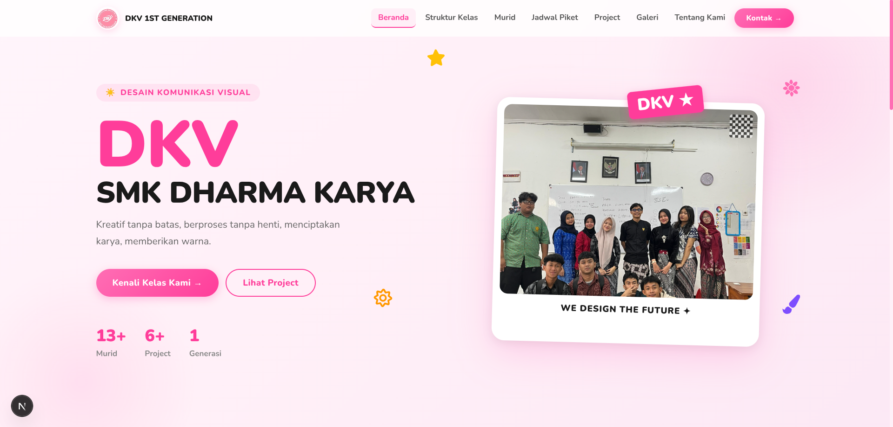

# DKV Class Website

A modern and responsive class profile website for **DKV (Desain Komunikasi Visual)** built with **Next.js**.

This website was created as a personal project to showcase my class information, including the organizational structure, gallery, class duty schedule, and other activities, all presented in a clean and interactive interface. 

!! DISCLAIMER !!

This project Unfinished yet.

## Features

* Modern and responsive design
* Class profile
* Organizational structure
* Photo gallery
* Class duty schedule (Piket)
* Contact page
* Smooth scrolling and simple animations

## Tech Stack

* Next.js
* React
* JavaScript (JSX)
* TypeScript
* CSS
* AI Agents (little bit)

## Project Structure

```text
public/      # Static assets (images, videos, icons)
src/
 ├── app/          # Next.js App Router
 ├── components/   # Reusable components
 ├── data/         # Static data
 ├── styles/       # CSS styles
 └── utils/        # Utility functions
```

## Getting Started

Clone this repository:

```bash
git clone https://github.com/v1ckyfrfr/website-kelas.git
```

Move into the project directory:

```bash
cd website-kelas
```

Install dependencies:

```bash
npm install
```

Run the development server:

```bash
npm run dev
```

Then open:

```text
http://localhost:3000
```

## Production Build

```bash
npm run build
npm start
```

## Preview



## Author

**Vicky Rachman (v1ckyfrfr)**

